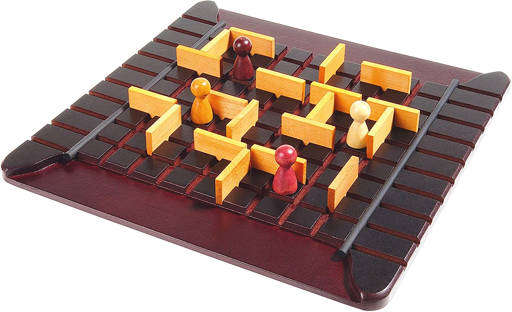

###### Практична робота №1
## Розробка клієнта для настольної гри Quoridor

### Мета роботи:
Розібратись із використанням паттерну MVC у ігрових проектах на прикладі настольної гри Quoridor, підготувати проект для виконання другої роботи.

### Завдання:

Минулого року, в рамках нашого курсу ми розробляли штучний інтелект для гри реверсі (завдання минулого року все ще доступні в цьому репозиторії в папці [assignments/2020](../2020)). Цього року, ми виконаємо схоже завдання для цікавої, але трохи більш складної гри - Quoridor.

Quoridor - настільна гра для двох або чотирьох гравців з достатньо простими правилами, але глибокою стратегією. Наступні дві роботи ми будемо займатися реалізацією комп'ютерної версії цієї гри та АІ до неї. Детальніше про саму гру та правила можна почитати [тут](https://desktopgames.com.ua/quoridor.html), pdf з правилами також доступний [в репозиторії](../res/quoridor_rules_ru.pdf). 

Рекомендую також подивитись відео: [англійською](https://www.youtube.com/watch?v=6ISruhN0Hc0) або [російською](https://www.youtube.com/watch?v=Xv3BppTJ-_8) Спробувати сили та пограти можна в [онлайні](http://quoridor.di.uoa.gr/)

Також у вас буде можливість прийти та пограти в неї вживу :)

В рамках завдання неохідно створити програму, що виконує наступні вимоги:
- програма є клієнтом для гри у Quoridor для двох гравців;
- користувач може обрати: або ходити за обох опонентів, або грати проти комп'ютерного гравця який грає за примітивною стратегію - робить випадковий із можливих кроків. (Тобто або рухається у випадковому напрямку, або виставляє стінку у випадкове дозволене місце);
- програма не дозволяє робити не коректні ходи;
- програма фіксує переможця;

На програмному рівні має бути виділено три компонента:
- відображення - ui-код, що відноситься до рендеру клієнта. Вимог до реалізації немає, це може бути як стенделоун-додаток, так і команда строка з ASCII-артом або веб-сторінка.
- введення - частина програми, що оброблює інпут та перенаправляє його в модель. Дуже важливо чітко виділити цей компонент, оскільки в другій роботі його доведеться замінити на ввід з командної строки.
- модель - весь код, що відноситься до бізнес-логіки, тобто гри Quoridor. Ця частина коду знадобиться в наступній роботі, де не буде необхідності в виводі результату на екран, і буде інший інпут

### Примітки

Розділення програми на компоненти згідно паттерну MVC стає в нагоді в багатьох моментах, на прикладі двох робіт ми розглянемо часту ситуацію, коли всередині гри потрібно паралельно підтримувати дві системи вводу (від гравця та програмний від AI) та дві системи виводу (вивід у клієнт або лімітований вивід при грі з АІ). 
Реальні приклади такого розділення: 
- match3-ігри, в яких нові рівні перед релізом тестуються  штучним AI "гравцем", і складність рівня змінюється відповідно до успіхів бота. Очевидно, що якщо ми хочемо програти рівень ботом 100 разів, то ми не хочемо робити у повноцінному клієнті зі всіма ефектами та анімаціями, а хочемо лише отримати короткий звіт за результатами роботи. 
- серверні ігри типу шахів або казино, де логіка дублюється на клієнті і сервері - клієнт зчитує хід з UI і відображає його результати на інтерфейсі, а сервер отримує цей хід вже за певним протоколом через мережу, і валідує його корректність.

Одним із важливих праивл гри є заборона повністю блокувати оппоненту шлях, а це означає що вам доведеться після кожного ходу перевіряти наявність шляху від кожного гравця до краю поля. Для цієї задачі та поля 9х9 вам цілком вистачить алгоритму [Флойда](https://en.wikipedia.org/wiki/Floyd%E2%80%93Warshall_algorithm) або [Дейкстри](https://en.wikipedia.org/wiki/Dijkstra%27s_algorithm). Також можна реалізувати [A*](https://en.wikipedia.org/wiki/A*_search_algorithm). Якщо ці алгоритми для вас нові, можете подивитись першу частину лекції про [AI](https://www.youtube.com/watch?v=RKFItb_fPZk&list=PLkgXLMuasx7C7yMUsaq366htPg9rpM2lw&index=5), де ми розглядаємо пошук шляхів.

Виконуючи цю роботу, тримайте на увазі що код вашої гри має бути саме таким - незалежним від вводу\виводу

### Оцінювання:
- реалізовано клієнт з повними правилами гри - *3 бали*
- не має можливості робити неправильні ходи - *2 бали*
- клієнт має повний game loop (можна почати гру, закінчити її та почати знову будь-яку кількість разів без перезапуску) - *2 бали*
- є можливість грати з комп'ютером та за двох гравців - *2 бали*
- якість реалізації MVC - *3 бали*

### Матеріали:
- [Лекція із загальних правил проектування програм](https://www.youtube.com/watch?v=_YL5SCJr84E&list=PLkgXLMuasx7C7yMUsaq366htPg9rpM2lw)
- [Лекція з MVC](https://www.youtube.com/watch?v=6Avtm_qij2E&list=PLkgXLMuasx7C7yMUsaq366htPg9rpM2lw)
- [Репозиторій з прикладом з лекції](https://github.com/artem-korotenko/mvc-tic-tac-toe)
- [Лекція з патернів ігрової розробки](https://www.youtube.com/watch?v=j-JtShcib4E&list=PLkgXLMuasx7C7yMUsaq366htPg9rpM2lw)
