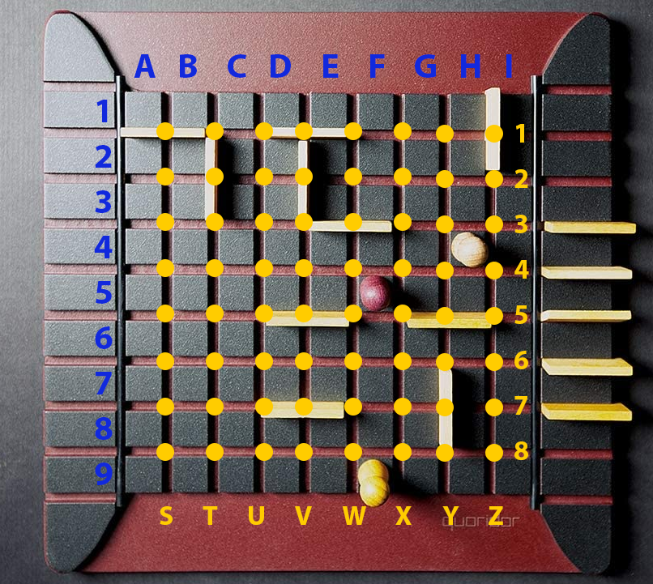

###### Практична робота №2

## Розробка штучного інтелекту для гри Quoridor

### Мета роботи:

Розібратися з алгоритмами штучного інтелекту, що використовуються для детермінованих ігор з повною інформацією.
Реалізувати штучний інтелект для гри з першої роботи.

### Завдання:

В минулій роботи було реалізовано клієнт для гри Quoridor. Як ви пам'ятаєте, окремим пунктом в завданнях було вказано
звернути увагу на розділення коду на модулі - модель, обробку введення та візуалізацію. В данній роботі нам знадобиться
зроблена модель (input та view доведеться створити нові), оскільки ціль роботи - створення штучного інтелекту для гри.

Робота над штучним інтелектом складається з двох частин:

1. Створити штучний інтелект, що буде перемагати опонента який грає за примітивною стратегією 90% (або більше) випадків.
   Виконання цього пункту дозволить здати практичну роботу №2 та отримати відповідну кількість балів. В цьому документі
   описана саме ця частина.
2. Створити бота, що буде здатен перемогти ботів інших команд. Змагання буде проходити в декілька турів, команди що в
   підсумку покажуть найкращий результат отримують додаткові бали.

### Деталі

Перший важливий момент - Quoridor як гра достатньо мало вивчена порівняно з шахами, шашками або го. В інтернеті можна
знайти декілька статей по штучному інтелекту для цієї гри та декілька репозиторієв з кодом. Пам'ятайте, що для нас цей
проект - навчальний, для того щоб виконати другу роботу достатньо реалізувати не надто складний алгоритм, а у
майбутньому змаганні буде первірятись не вміння гуглити готовий код, а бажання побільше та поглибше розібратись із
темою. Тому знаходження будь-якого плагіату\копіпасти в цій роботі або змаганні буде каратись нулем балів за другу
роботу та змагання

За умовами завдання не виставляється конкретна вимога який саме алгоритм реалізовувати для штучного інтелекту, проте я
рекомендую почати з мінімаксу: реалізувати власне дерево мінімаксу, подумати про підрахунок SEV, далі додати альфа\бета
відсікання для збільшення глибини прорахунку та ускладнювати бота лише ітеративно. Рекомендую братися за більш складні
варіанти (наприклад, MCTS) тільки коли ви будете мати робочу версію з мінімаксом, яка проходить всі тести.

Як тільки ви реалізуєте дерево мінімаксу (можна для початку взяти найпростішу SEV, що повертає значення, обернено
пропорційне до кількості кроків до перемоги), у вас буде декілька можливих шляхів покращення алгоритму:

1. Оптимізувати дерево для того щоб мати змогу передивлятися його на більшу глибину;
2. Скорочувати кількість варіантів ходу які ви переглядаєте - кожен хід ви можете ставити стінку в будь-яке вільне місце
   на полі, але скоріш за все якийсь геймплейний сенс будуть мати лише декілька таких ходів. Можна спробувати якимось
   чином скорочувати цей перебір, або не перевіряти всі ходи на початку гри а обмежетись декількома дебютами і т.д.;
3. Покращувати саму SEV - пріоретизувати ходи над постановкою стінок або навпаки, враховувати кількість доступних
   шляхів (щоб лишити собі одний зручний прохід) тощо.

Другий важливий момент - Для того щоб мати змогу змагатися один з одним, боти мають реалізовувати певний спільний
інтерфейс. Найпростішим варіантом такого інтерфейсу є командний рядок, оскільки створити подібну програму можна за
допомогою всіх розповсюджених мов програмування та платформ. Отже, якщо попередня робота виконана вами коректно, то вам
не буде складно підмінити введення з графічного (з клієнту) на введення з командної строки, а виведення ходу - на вивід
в командний рядок.

Вимоги до програми:

1. Програма має запускатися через командний рядок та зчитувати ввід з `system.in`
2. На початку виконання программа має отримати вказанням кольору, яким пропонується грати (у форматі `white`
   або `black`). Вважаємо, що на вертикально розташованій дошці чорний гравець знаходиться зверху (клітинка `E1`), а білий - знизу (`E9`). Білі
   ходять першими, тому якщо білими грає ваш бот, одразу після першої команди будуть очікуватися координати ходу. Якщо
   чорними - третьою командою прийде хід чорних
4. Далі програма має видавати наступний хід після кожного введенего ходу противника.

Программа буде тестуватися за допомогою спеціального клієнта, який буде її запускати та виступати в ролі противника, що
ходить за певною примітивною стратегією. Вихідний код тестувальника буде викладено незабаром. Для того щоб тест був
пройдений успішно, команда отримала базові бали та була допущена до змагання, необхідно щоб виконувалися наступні умови:

1. При запускові 100 раундів ігор проти бота, бот перемагає у 90 або більше.
2. Бот працює без помилок: будь-яка помилка у рантаймі програми буде призводити до зарахування технічної поразки в
   раунді.
3. Бот працює у рамках виділених ресурсів: кожен хід вкладається у 2 секунди, бот використовує не більше 1Гб оперативної
   пам'яті. Вихід за рамки цих вимог також призводить до технічної поразки. Обмеження у 2 секунди буде вимірюватися на
   тестовому пристрої з CPU i7-8700.
4. Технічна поразка також зараховується у випадку якщо програма видає неможливий на даний момент хід.

Кожен хід складається з команди (`move`, `jump` або `wall`) та координат. `move` завжди означає переміщення у сусідню
порожню клітинку, `jump` - стрибок через іншого гравця. Координати клітинок та стінок відрізняються, детальна схема наведена нижче. Розглянемо приклад
командної строки при роботі з ботом (`->` - ввід, `<-` - вивід з програми):

```
-> black      //  перша команда - колір яким пропонується грати
-> move E8    //  бот грає чорними, тому наступний хід теж вводиться. Це переміщення білого гравця у клітинку Е8
<- wall V7h   //  бот вирішує поставити стінку. h наприкінці означає горизонтальну стінку, v - вертикальну
```

і так далі

Схема розмітки поля та стартова позиція:



Перед здачею роботи необхідно зібрати консольний додаток під win64 додати у релізи на вашому гітхаб-репозиторії

### Оцінювання:

- бот перемагає у 90 іграх зі 100 - *4 бали*
- бот перемагає у 100 іграх зі 100 - *1 бал*
- бот не отримує жодної технічної поразки - *1 бал*
- якість написання коду - *2 бали*

### Матеріали:

- [Лекція із штучного інтелекту (minimax, MCST)](https://www.youtube.com/watch?v=zlEI6ii28_A&list=PLkgXLMuasx7C7yMUsaq366htPg9rpM2lw&index=5)
- [Стаття з мінімаксу на вікіпедії](https://en.wikipedia.org/wiki/Minimax)
- [Альфа\бета відсікання](https://en.wikipedia.org/wiki/Alpha%E2%80%93beta_pruning)

### Література

Посилання йдуть амазон, але всі матеріали можна знайти в мережі

- [AI for games (chapter 9)](https://www.amazon.com/AI-Games-Third-Ian-Millington/dp/1138483974)
