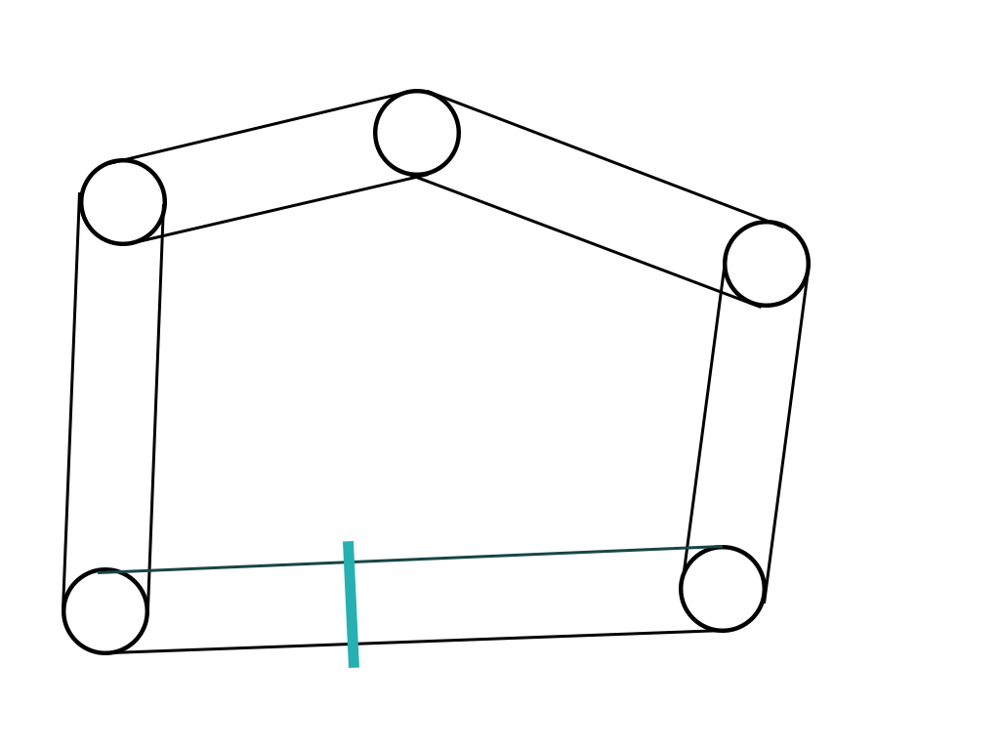

###### Практична робота №3
## Реалізація  Steering behaviours

### Ціль роботи
Реалізувати наступні поведінки: блукання, переслідування, втеча, уникнення зіткнення та груповий рух. Спробувати як комбінування простих поведінок використовується для імітації складних систем.

Для виконання пропонується обрати один з двох варіантів:

#### Варіант А. Гра Hunter (12 балів)

### Завдання
Вся графіка у грі є непринципивою і може бути реалізована схематичними колами.
1. Гра представляє собою схематичне поле без перешкод з видом зверху. Поле обмежено прямокутними кордонами - "обривом".
2. Гравець керує **мисливцем**, який може рухатись в усі сторони (мишкою або WASD) та стріляти на певну відстань. Після попадання у здобич, здобич гине. Кількість патронів у мисливця обмежена.
3. На полі знаходяться:
  - **Зайці**. Особи, які повільно переміщуються (блукають), але швидко тікають від будь-яких інших осіб (навіть інших зайців);
  - **Лані**. Особи, що переміщуються групами (групами блукають та тікають, повертаються у групу якщо відбились по якійсь причині). Бояться мисливців та вовків. Відчувають вовків здалеку та уникають;
  - **Вовки**. Одинаки, нападають на зайців, ланей та мисливця. У звичайному режимі блукають, але мають певний радіус (менший за радіус "чуття" ланей) у якому можуть "почути" здобич та почати переслідувати. Рухаються повільніше зайців, швидше ланей (так, нереалістично) та швидше мисливця, після того як наздоганяють здобич - вбивають її. Гинуть, якщо певний час не можуть знайти здобич.
4. Перед стартом гри генерується певна кількість зайців, вовків та груп ланей  на полі. Кожна група ланей має 3-10 особин. Після старту обрані особини та групи мають бути сгенеровані та розміщені на полі у випадковому порядку. Точна кількість особин має бути доступна для конфігурування;
5. Всі тварини намагаються уникнути обриву і гинуть якщо падають з нього (перетинають кордон).

### Деталі
Steering behaviours - набір простих, але потужних у варіантах використання алогритмів для імітації поведінок. В поєднанні з пошуком шляхів є основою великої кількості навігаційних систем. В даній роботі пропонується на прикладі простої гри-симуляції полювання розібрати декілька основних поведінок та реалізувати їх. Детальне пояснення алгоритмів та інтерактивні приклади доступні за посиланнями у матеріалах.

### Оцінювання
1. Реалізація усіх поведінок - *5 балів*
2. Реалізація мисливця - *4 бали*
3. Загальна якість коду - *3 бали*

#### Варіант Б. Гра Street Racer (12 балів)
1. Гра представляє собою схематичний 2D-трек для перегонів, який можна представити собі як ламану лінію з певним радіусом. Приклад схематичного зображення треку можна побачити нижче;
2. Гравець керує **болідом**, що може рухатися по карті (як по треку так і за його межами). Болід може розганятися та приторможувати; 
3. По треку колами їздить певна кількість автомобілей - вони мають різну швидкість, притримуються власного маршруту та уникають зіткнення з іншими авто;
4. Є поліцеські машини - вони стоять на узбіччі та мають радіус, в якому дивляться за авто - якщо авто проїжджає на швидкості, більшій за допустиму, поліцейська машина буде наздоганяти 
порушника, поки той буде в полі зору. Якщо поліцейський доганяє гравця - гра закінчується;
5. По карті невеликими групками ходять перехожі - вони можуть переходити дорогу та намагаються не потрапити пд машину. Якщо машина збиває пішохода, вона зупиняється на певний час;
6. Будь-яка машина сповільнюється, якщо виїжджає за межі треку;
7. Суть гри - якомога швидше проїхати декілька кіл, не будучи спійманим копами.

### Оцінювання
1. Реалізація боліду - *2 бали*
2. Гейм-луп - *3 бали*
3. Поліцейські - *2 бали* 
4. Перехожі - *2 бали*
5. Загальна якість коду - *3 бали*

### Матеріали
1.[Лекція по Steering behaviours](https://www.youtube.com/watch?v=mNOANy_4wCg&list=PLkgXLMuasx7C7yMUsaq366htPg9rpM2lw&index=6)
2.[Детальна стаття з прикладами](https://natureofcode.com/book/chapter-6-autonomous-agents/)
3.[Ще трохи прикладів](https://gamedevelopment.tutsplus.com/series/understanding-steering-behaviors--gamedev-12732)
